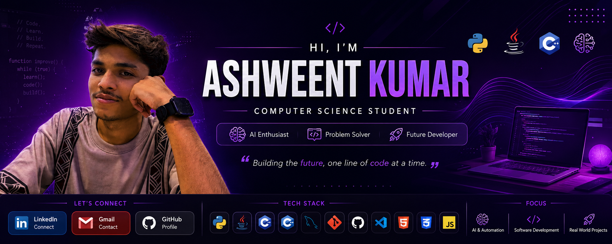

  

  

<h1 align="center">Hi 👋, I'm Ashweent Kumar</h1>

<h3 align="center">Computer Science Student | Python Developer | AI Enthusiast</h3>

Passionate about building real-world software, learning Artificial Intelligence, and solving problems through code.

  
  
  

---

# 💫 About Me

🎓 2nd Year Computer Science Student

💻 Learning Python, Java, SQL, C and Artificial Intelligence

🚀 Interested in AI, Automation and Software Development

📚 Currently building projects to strengthen my programming skills

🎯 Goal: Become a Software Engineer and AI Engineer

---

# 🛠️ Languages & Tools

---

# 📊 GitHub Stats

  
  

---

# 🔥 GitHub Streak

---

# 💻 Most Used Languages

---

# 📈 Contribution Graph

---

# 🏆 GitHub Trophies

---

# 🚀 Featured Projects

⭐ ATM Simulator (Java Swing)

⭐ Weather Application

⭐ VPN Project

⭐ Maps Project

⭐ AI Projects

⭐ C Programming Collection

---

# 👀 Profile Views

---

# 💬 Quote

> *"Code. Learn. Build. Repeat."* 🚀

  

---

⭐ Thanks for visiting my profile! ⭐

If you like my work, don't forget to ⭐ my repositories.

